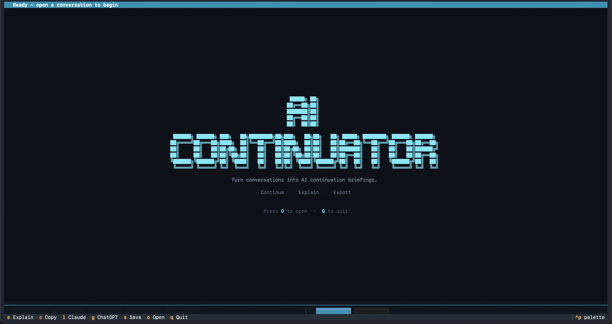
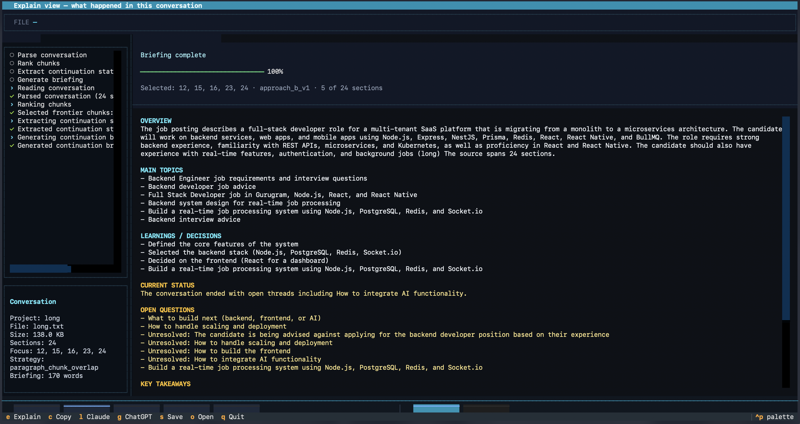

# Continuator

**Turn a long conversation into a continuation briefing for another AI.**

Paste a long ChatGPT, Claude, Cursor, or tutoring thread — get a structured handoff (objective, where you left off, completed work, blockers, next action). Paste the briefing into a fresh chat to continue.

Works best on **coding, tutorial, project, and debugging** threads. Not designed for medical Q&A or one-off lookups.

---

## Screenshots

**Welcome screen** — launch the TUI with `continuator`:



**Explain view** — retrospective summary of a long conversation:



---

## Requirements

| Requirement | Details |
|-------------|---------|
| Python | **3.10+** (`python3 --version`) |
| OS | macOS, Linux, or Windows |
| Disk | ~2 GB for model weights (first run downloads from Hugging Face) |
| Git | To clone the repo |

---

## Setup (copy-paste)

Clone the repo, create a virtual environment, install Continuator, and pick the **ML backend for your machine**.

### macOS (Apple Silicon — M1/M2/M3/M4)

```bash
git clone https://github.com/ac-mmi/continuator.git
cd continuator
git checkout release/v0.1

python3 -m venv .venv
source .venv/bin/activate
pip install --upgrade pip
pip install -e ".[mlx]"
```

### macOS (Intel) · Linux · Windows

Use the **transformers** backend (PyTorch). Linux may need build tools (`build-essential` on Ubuntu/Debian).

**macOS / Linux:**

```bash
git clone https://github.com/ac-mmi/continuator.git
cd continuator
git checkout release/v0.1

python3 -m venv .venv
source .venv/bin/activate
pip install --upgrade pip
pip install -e ".[transformers]"
```

**Windows (PowerShell):**

```powershell
git clone https://github.com/ac-mmi/continuator.git
cd continuator
git checkout release/v0.1

python -m venv .venv
.\.venv\Scripts\Activate.ps1
python -m pip install --upgrade pip
pip install -e ".[transformers]"
```

> **Note:** Run all commands from the repo root (the folder that contains `continuator/` and `continuator_engine/`). Do not `cd` into the inner `continuator/` package folder.

---

## Verify install (no model download)

Confirms the CLI and TUI load correctly **without** downloading the LoRA adapter:

**macOS / Linux:**

```bash
source .venv/bin/activate
MEMORY_EXTRACTOR_BACKEND=mock continuator continue examples/neck.txt --quiet
```

**Windows (PowerShell):**

```powershell
.\.venv\Scripts\Activate.ps1
$env:MEMORY_EXTRACTOR_BACKEND="mock"
continuator continue examples/neck.txt --quiet
```

You should see a structured briefing printed. If that works, installation succeeded.

---

## First real run

**Important:** Opening the TUI (`continuator`) alone does **not** download anything. Models download when you **open a conversation file and run analysis** (press `O` in the TUI, or use `continuator continue FILE` in the terminal).

The first extraction downloads from Hugging Face (~1–5 minutes depending on connection and platform):

| Component | Source |
|-----------|--------|
| V10 LoRA adapter | `ac-mmi/continuator-v10-lora` |
| Base model | `Qwen/Qwen2.5-1.5B-Instruct` |
| Chunk ranker embedder | `sentence-transformers/all-MiniLM-L6-v2` |

**Windows:** You must install the transformers extra (`pip install -e ".[transformers]"`). The base `pip install -e .` alone does **not** install PyTorch. If analysis fails silently in the TUI, test in PowerShell first:

```powershell
.\.venv\Scripts\Activate.ps1
continuator continue examples/neck.txt -v
```

Use `-v` to see download and extraction errors.

### Option 1 — Terminal UI (easiest)

```bash
continuator
```

Open a sample file from the file picker, or paste a path like `examples/neck.txt`.

### Option 2 — CLI with a file

```bash
continuator continue examples/neck.txt
```

Other samples in [`examples/`](examples/):

| File | Good for |
|------|----------|
| `neck.txt` | Short tutorial thread (fast first run) |
| `gitissue.txt` | Coding / GitHub issue |
| `jquery.txt` | Coding / learning session |

### Option 3 — Paste from clipboard (no save step)

**macOS:**

```bash
pbpaste | continuator continue -
```

**Linux** (install `xclip` if needed: `sudo apt install xclip`):

```bash
xclip -o -selection clipboard | continuator continue -
```

**Windows (PowerShell):**

```powershell
Get-Clipboard | continuator continue -
```

---

## Checkpoint & resume (save state)

Save structured state and resume later **without re-running the model**:

```bash
# Save checkpoint to .continuator/checkpoint.yaml
continuator checkpoint examples/gitissue.txt

# Print cached briefing (fast, no model load)
continuator resume
```

Incremental update when a conversation grew (append-only):

```bash
continuator checkpoint my-chat.txt --update
```

---

## Command cheat sheet

| Command | What it does |
|---------|----------------|
| `continuator` | Interactive terminal UI (default) |
| `continuator continue FILE` | Continuation briefing |
| `continuator explain FILE` | Retrospective summary |
| `continuator checkpoint FILE` | Save v2 checkpoint |
| `continuator resume` | Load cached briefing from checkpoint |
| `continuator export FILE --for claude` | Paste block for Claude/ChatGPT/Gemini |
| `continuator inspect FILE` | Chunk/ranker audit (no extraction) |
| `continuator benchmark DIR` | Batch quality check on a folder |

Use `-` as the file to read from stdin (see clipboard examples above). Add `-q` for minimal output, `-v` for technical details. Run `continuator --help` for all subcommands.

---

## Model download (optional pre-fetch)

On first real run, weights download automatically to `~/.cache/continuator/models/v10/`.

To download ahead of time:

```bash
pip install huggingface_hub
hf download ac-mmi/continuator-v10-lora --local-dir ~/.cache/continuator/models/v10
```

Windows: use `%USERPROFILE%\.cache\continuator\models\v10` instead of `~/.cache/...`.

---

## Troubleshooting

| Problem | Fix |
|---------|-----|
| TUI opens but nothing downloads | **Expected** until you press `O` and open a `.txt` file — or run `continuator continue FILE` in the shell |
| Analysis fails on Windows (no download) | Install transformers backend: `pip install -e ".[transformers]"` — not just `pip install -e .` |
| Errors hidden in TUI | Re-run with `continuator continue examples/neck.txt -v` in PowerShell to see full output |
| `continuator: command not found` | Activate venv: `source .venv/bin/activate` (macOS/Linux) or `.\.venv\Scripts\Activate.ps1` (Windows) |
| `No module named 'checkpoint_merge_v1'` | Reinstall from repo root: `pip install -e .` (or `pip install -e ".[mlx]"` / `".[transformers]"`) |
| `continuator_engine not found` | Run `pip install -e .` from the **repo root**, not from inside `continuator/` |
| MLX error on Apple Silicon | `pip install -e ".[mlx]"` |
| Torch/transformers error on Windows/Linux | `pip install -e ".[transformers]"` |
| Hugging Face download fails | Check https://huggingface.co/ac-mmi/continuator-v10-lora is reachable; set `HF_TOKEN` if gated |
| Slow first run | Normal — downloads embedder + LoRA once |
| Weak / useless briefing | Thread may be Q&A or medical chat — try `examples/gitissue.txt` instead |
| Windows script execution blocked | `Set-ExecutionPolicy -Scope CurrentUser RemoteSigned` then re-activate venv |

More: [`.env.example`](.env.example)

---

## Environment variables (common)

| Variable | Default | Purpose |
|----------|---------|---------|
| `MEMORY_EXTRACTOR_BACKEND` | auto (`mlx` or `transformers`) | Set to `mock` for smoke tests |
| `MEMORY_EXTRACTOR_ADAPTER_PATH` | — | Use a local adapter directory |
| `HF_TOKEN` | — | Hugging Face token if needed |

---

## Development

```bash
pip install -e ".[dev]"
pytest
```

---

## Architecture

```
continuator/           CLI + TUI
continuator_engine/    V10 extraction pipeline
examples/              Sample conversations
validation_runs/       Output from validation runner (optional)
```

Extraction uses a fine-tuned LoRA on Qwen2.5-1.5B-Instruct. Weights are fetched from Hugging Face — not stored in Git.

---

## License

MIT — see [LICENSE](LICENSE).
