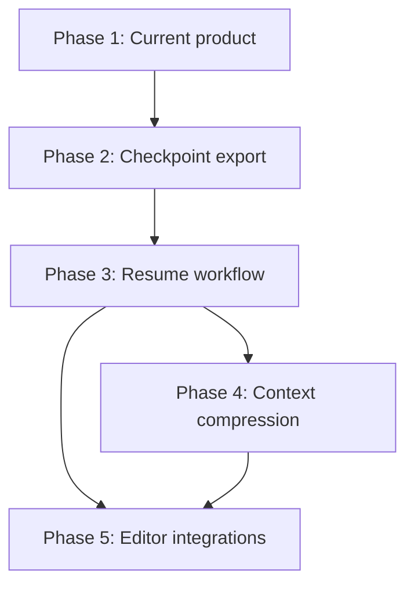

# Continuator Checkpointing Roadmap

**Vision:** Evolve Continuator from a continuation briefing tool into **infrastructure for AI conversation state** — checkpoint, resume, compress, and hand off structured context across sessions, models, and editors.

**North star:** "Git for AI conversations" — durable, diffable, resumable conversation state.

**Current baseline:** v0.1 (`release/v0.1`) — one-shot transcript → structured briefing pipeline.

---

## Roadmap overview

```
Phase 1 ──► Phase 2 ──► Phase 3 ──► Phase 4 ──► Phase 5
(current)   (export)     (resume)     (compress)   (editors)
   │            │            │             │            │
   ▼            ▼            ▼             ▼            ▼
continue    checkpoint    resume        compress     Cursor
explain     artifact      instant       tier API     Claude Code
export      YAML/JSON     handoff       token budget Codex
inspect     list/show     --refresh     --stats      VS Code
TUI         diff v0       no re-run     ratios       plugins
```

**Estimated engineering effort (rough):**

| Phase | Effort | Depends on |
|-------|--------|------------|
| 1 | Shipped | — |
| 2 | 2–3 weeks | Phase 1 pipeline |
| 3 | 2–3 weeks | Phase 2 artifact format |
| 4 | 1–2 weeks | Phase 2–3 |
| 5 | 4–8 weeks per integration | Phase 3 resume API |

---

## Phase 1: Current Product (shipped)

**Positioning:** "Turn a long conversation into a continuation briefing for another AI."

**Status:** ✅ v0.1 public beta

### Capabilities

| Command | Function |
|---------|----------|
| `continuator continue FILE` | V10 extract → frontier merge → continuation briefing |
| `continuator explain FILE` | Same extraction → retrospective summary |
| `continuator export FILE --for {claude,chatgpt,gemini,markdown}` | Platform paste blocks |
| `continuator inspect FILE` | Chunk/rank audit without LoRA |
| `continuator benchmark DIR` | Batch quality evaluation |
| `continuator` (no args) | Textual TUI |

### Pipeline (production)

```
read_transcript()
  → chunk (paragraph, ~6000 chars, 500 overlap)
  → rank (approach_b_v1, K=3–8, zero-LLM Stage 1)
  → extract (V10 LoRA per selected chunk)
  → aggregate (continuation_export_v2_frontier: History vs Frontier)
  → render (Rich CLI / TUI / export wrapper)
```

### What Phase 1 proves

- V10 structured extraction works on real long threads
- Ranker selects salient chunks without LLM cost
- Frontier aggregation produces actionable handoffs
- Local inference (MLX/transformers) is viable
- CLI/TUI UX is polished enough for beta

### Phase 1 gaps (motivation for Phase 2+)

- Every run is full re-extraction from scratch
- Output is ephemeral text (`-o` optional); no checkpoint library
- No resume without re-supplying full transcript
- No compression tier control
- No editor or IDE integration

### Phase 1 metrics to track

- `continue` completion rate and time-to-briefing
- Briefing quality rubric pass rate (`benchmark`)
- Repeat usage (same user, multiple runs) — expect low until Phase 2

---

## Phase 2: Checkpoint Export

**Positioning shift begins:** "Save structured conversation state you can reuse."

**Goal:** Persist the extraction pipeline output as a versioned artifact. No behavior change to existing commands — additive only.

### Deliverables

#### 2.1 Checkpoint artifact format (v1)

Define `CheckpointRecord` wrapping existing V10 output:

```yaml
# ~/.continuator/checkpoints/<project>/<id>.yaml
checkpoint:
  format_version: 1
  id: <short-hash>
  project: <name>
  message: <optional user note>
  created_at: <ISO8601>
  source:
    path: <original file>
    sha256: <content hash>
    char_count: <int>
  pipeline:
    baseline: v10-050+repair+continuation_export_v2_frontier
    ranker_strategy: approach_b_v1
    chunks_total: <int>
    chunks_selected: [<indices>]
    frontier_band: [<indices>]
  state:          # V10 fields — already extracted today
    objective: []
    current_state: ""
    completed_work: []
    active_problems: []
    resolved_problems: []
    constraints: []
    continuation_context: ""
  cached_exports:
    briefing: |     # output of generate_continuation_briefing_frontier
    explain: |      # optional, generated on first request
```

**Reuse from existing code:**

- `record_to_extraction_output()` — state serialization
- Rank audit from `continuator_chunk_ranker_v1.rank_chunks()` return value
- Briefing text from `continuation_export_v2_frontier.generate_continuation_briefing_frontier()`
- Explain text from `conversation_explainer_v1` (lazy cache)

#### 2.2 New commands

```bash
continuator checkpoint FILE [--name PROJECT] [--message MSG] [-o PATH]
continuator checkpoint list [--project NAME]
continuator checkpoint show [ID|PATH] [--json]
continuator checkpoint diff CHECKPOINT_A CHECKPOINT_B
```

#### 2.3 Storage layout

```
~/.continuator/
  checkpoints/
    neck-refactor/
      a3f2.yaml
      b7c1.yaml
    auth-module/
      d4e8.yaml
  config.yaml          # default project, paths
```

#### 2.4 TUI additions

- `[s]` save checkpoint (currently saves briefing file — repurpose to checkpoint artifact)
- Checkpoint browser panel (list recent checkpoints)
- Show compression ratio on save

#### 2.5 README repositioning

Update hero line to:

> **Checkpoint long AI conversations into structured state you can resume anywhere.**

Keep `continue` as primary quick-start example.

### Phase 2 non-goals

- Incremental update (Phase 3)
- Resume without transcript (Phase 3)
- Compression tiers (Phase 4)
- Editor plugins (Phase 5)

### Phase 2 success criteria

- Checkpoint save/load round-trips without data loss
- `checkpoint diff` shows meaningful field-level changes
- Existing `continue`/`explain`/`export` unchanged
- Checkpoint artifact documented as stable v1 format

### Phase 2 risks

- Artifact format churn — mitigate with `format_version` and migration script
- Disk usage on large transcripts — store source hash, not full transcript by default; optional `--include-source`

---

## Phase 3: Resume Workflow

**Positioning:** "Resume any AI conversation from a checkpoint — instantly."

**Goal:** Load checkpoint → emit handoff without re-running LoRA unless explicitly requested.

### Deliverables

#### 3.1 `continuator resume`

```bash
continuator resume CHECKPOINT.yaml                    # briefing (cached)
continuator resume CHECKPOINT.yaml --format explain   # retrospective
continuator resume CHECKPOINT.yaml --format state     # raw V10 JSON/YAML
continuator resume CHECKPOINT.yaml --format frontier  # frontier band only
continuator resume CHECKPOINT.yaml --for claude       # platform wrapper
continuator resume CHECKPOINT.yaml --copy             # clipboard
continuator resume CHECKPOINT.yaml --refresh          # re-extract from source
```

**Performance target:** Resume from cache < 500ms. Full refresh same as current `continue`.

#### 3.2 Incremental checkpoint update

```bash
continuator checkpoint chat.txt --update PROJECT
```

Behavior:

1. Load latest checkpoint for project
2. Compare source hash — if transcript grew, identify new tail
3. Re-chunk only affected region; re-rank with terminal lock
4. Extract new/changed chunks only
5. Merge into existing V10 state (frontier wins for position/actives; union for completed/constraints)
6. Save new checkpoint version

**Reuse:**

- Frontier merge logic in `continuation_export_v2_frontier.py`
- List aggregation in `continuation_export_v1._aggregate_list_field()`
- Ranker terminal lock ensures latest context always extracted

#### 3.3 Checkpoint lineage

- Each `--update` creates new checkpoint ID linked to parent
- `continuator checkpoint log PROJECT` shows chain
- `continuator checkpoint diff` works across lineage

#### 3.4 Legacy command mapping

| Legacy | New path |
|--------|----------|
| `continuator continue FILE` | `continuator checkpoint FILE -q && continuator resume` |
| `continuator export FILE --for claude` | `continuator resume CP --for claude` |

Add deprecation notices in Phase 3; keep legacy commands functional through Phase 4.

#### 3.5 TUI resume mode

- Open checkpoint file from browser
- Instant briefing/explain toggle (no spinner for cached)
- `[u]` update from source file if changed

### Phase 3 success criteria

- Resume from checkpoint is instant (cached export)
- Incremental update faster than full re-extract on 2× transcript growth
- Field merge produces same quality as full re-run on benchmark set (≥95% rubric parity)
- Users can maintain a checkpoint library across sessions

### Phase 3 risks

- Incremental merge quality regressions — require benchmark gate before release
- Stale frontier if user edits middle of transcript — detect via hash mismatch, warn user

---

## Phase 4: Context Compression

**Positioning:** "Compress any conversation to fit your context window."

**Goal:** Explicit compression tiers for token-limited handoffs — a first-class product surface, not an implicit side effect of extraction.

### Deliverables

#### 4.1 `continuator compress`

```bash
continuator compress FILE|CHECKPOINT
continuator compress FILE --tier {minimal,frontier,standard,verbose}
continuator compress FILE --max-tokens 500
continuator compress FILE --stats
```

#### 4.2 Tier definitions

| Tier | Fields included | Target size | Use case |
|------|----------------|-------------|----------|
| `minimal` | objective, current_state, next action | ~200–400 tokens | Agent with tight window |
| `frontier` | frontier band: position, active problems, next action, constraints (frontier) | ~400–800 tokens | "Where we are now" |
| `standard` | full V10 schema | ~800–1500 tokens | Default resume |
| `verbose` | V10 + top ranked chunk summaries | ~1500–3000 tokens | Team handoff, onboarding |

#### 4.3 Implementation approach

- **No new model required for v1 tiers** — field selection + existing aggregation
- `verbose` tier pulls from per-chunk V10 `summary` / `topic` fields already extracted
- Token estimation via simple char/4 heuristic; optional `tiktoken` extra
- `--max-tokens` selects highest tier that fits, truncates list fields last (never drop next action)

#### 4.4 Compression stats

Always show when `--stats` or default in verbose mode:

```
Input:   47,291 chars (~11,823 tokens est.)
Output:    1,247 chars (~312 tokens est.)
Ratio:   38:1
Tier:    standard
Fields:  7/7 V10 fields
```

#### 4.5 Integration with resume

```bash
continuator resume CP.yaml --tier minimal    # shorthand
continuator resume CP.yaml --max-tokens 500  # auto-select tier
```

### Phase 4 success criteria

- All tiers produce rubric-passing next action (never empty)
- Compression ratio ≥20:1 on benchmark corpus at `standard` tier
- `--max-tokens` never exceeds budget by >10%

### Phase 4 future (post-v1 tiers)

- Learned compression (fine-tune for tier targets) — only if field selection insufficient
- Multi-checkpoint compress (merge several projects into one handoff)

---

## Phase 5: Editor Integrations

**Positioning:** "Checkpointing built into where you already work."

**Goal:** Meet developers in Cursor, Claude Code, Codex, and VS Code — not require terminal context-switching.

### Integration architecture (shared)

```
Editor extension
  → calls continuator CLI (subprocess) OR continuator SDK (future)
  → reads/writes ~/.continuator/checkpoints/
  → injects resume output into editor context
```

Prefer CLI subprocess in Phase 5 v1 (no new API server). SDK wrapper in Phase 5 v2 if demand warrants.

### 5.1 Cursor

**Priority:** Highest — largest agentic-coding audience overlap.

| Feature | Behavior |
|---------|----------|
| Command palette: "Continuator: Checkpoint conversation" | Export current chat → checkpoint |
| Command palette: "Continuator: Resume checkpoint" | Pick checkpoint → insert as context |
| Command palette: "Continuator: Compress for context" | Tier selector → insert minimal/frontier |
| Status bar | Last checkpoint name + age |
| Auto-checkpoint (optional) | On session end or every N messages |

**Implementation:** Cursor extension (TypeScript) invoking `continuator checkpoint` / `continuator resume`. Chat export format TBD — may need adapter for Cursor's conversation export.

**Distribution:** Cursor extension marketplace + mention in Continuator README.

### 5.2 Claude Code

**Priority:** High — CLI-native audience, aligns with Continuator's terminal DNA.

| Feature | Behavior |
|---------|----------|
| `/continuator checkpoint` slash command | Checkpoint current session |
| `/continuator resume [project]` | Inject compressed context |
| Hook on session start | Offer to resume latest checkpoint for project dir |
| `CLAUDE.md` integration | Document checkpoint workflow per repo |

**Implementation:** Claude Code plugin or MCP server wrapping Continuator CLI. MCP may be cleaner for `resume` injection.

### 5.3 Codex (OpenAI)

**Priority:** Medium — audience growing with agentic coding push.

| Feature | Behavior |
|---------|----------|
| Codex CLI hook | Export thread → checkpoint on demand |
| Context injection | `continuator compress --tier minimal` into system/context |
| Project-scoped checkpoints | Match git repo root to checkpoint project name |

**Implementation:** Depend on Codex extension/hook API availability. Fallback: file watcher on exported conversation logs.

### 5.4 VS Code

**Priority:** Medium — broad reach, less agentic-session-native than Cursor.

| Feature | Behavior |
|---------|----------|
| Extension: Continuator panel | Checkpoint list, resume, compress |
| CodeLens on `.continuator/` folder | Quick resume |
| Task definition | `tasks.json` entry for checkpoint in CI/docs workflows |
| Copilot Chat integration | Insert compressed context (if API allows) |

**Implementation:** Standard VS Code extension; share core logic with Cursor extension where possible (monorepo).

### Phase 5 shared deliverables

- **Conversation export adapters** — normalize Cursor/Claude/ChatGPT export formats to Continuator input
- **`continuator resume --for cursor`** platform wrapper with Cursor-specific formatting
- **Extension monorepo** under `integrations/` with shared `@continuator/core` CLI bridge
- **Documentation** per editor with screenshots

### Phase 5 success criteria

- Checkpoint from editor in < 3 clicks
- Resume injects into new session without manual paste
- ≥1 editor integration shipped within Phase 5 first milestone (recommend Cursor first)

### Phase 5 risks

- Editor export format instability — build adapters with fixture tests
- Extension marketplace review delays — ship Cursor as sideload first
- Feature overlap as editors add native memory — differentiate on structured V10 + local + portable artifacts

---

## Cross-phase dependencies



Phase 4 can start in parallel with Phase 3 tail once artifact format is stable (Phase 2).
Phase 5 should not start until `resume` works reliably from checkpoint files (Phase 3).

---

## Positioning evolution by phase

| Phase | Hero line | Category |
|-------|-----------|----------|
| 1 (now) | Turn a long conversation into a continuation briefing | Continuation tool |
| 2 | Save structured conversation state you can reuse | Checkpoint export |
| 3 | Resume any AI conversation from where you left off | Session checkpointing |
| 4 | Compress conversations to fit any context window | Context compression |
| 5 | Checkpointing built into your editor | AI conversation infrastructure |

**"Git for AI conversations"** is earned at Phase 3 (resume + lineage + diff), reinforced at Phase 4 (compression tiers) and Phase 5 (daily workflow integration). Do not lead with this tagline until Phase 3 ships.

---

## What not to build (explicit non-goals)

- Cloud sync / multi-user checkpoint server (local-first stays core)
- Real-time collaboration on checkpoints
- Generic RAG / vector search over checkpoints
- Replacing IDE-native memory systems — complement, don't compete head-on
- Training new models in product (V10 LoRA updates remain offline research)

---

## Recommended next action

**Ship Phase 2.** The V10 schema, ranker, frontier aggregation, and export pipeline are ~80% of checkpoint export already. Phase 2 is primarily:

1. Define `CheckpointRecord` YAML wrapper around existing outputs
2. Add `checkpoint` / `checkpoint list` / `checkpoint show` commands
3. Update README positioning

This validates the repositioning hypothesis with minimal risk to v0.1 users and creates the artifact editors need in Phase 5.
