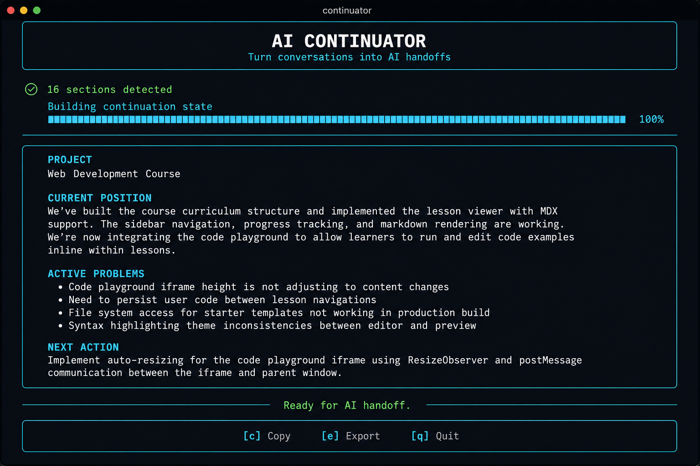

# Continuator CLI — UX examples

Visual reference for the Rich-polished terminal experience (pre-Textual).



**Layout note:** On an interactive terminal, header, progress bar, briefing panel, and shortcut footer all render on **one aligned column** at full terminal width (stderr). Use `--quiet` or `-o file` when you need plain briefing text on stdout.

## Default flow — `continuator continue chat.txt`

```
╭──────────────────────────────────────────────────╮
│                                                  │
│               AI CONTINUATOR                     │
│      Turn conversations into AI handoffs           │
│                                                  │
╰──────────────────────────────────────────────────╯

⠋ Reading conversation…
✓ 16 sections detected

⠋ Building continuation state… ━━━━━━━━━━━━━━━━━━━━━━ 100%

────────────────────────────────────────────────────

╭──────────────────────────────────────────────────╮
│  PROJECT                                         │
│  Web Development Course                          │
│                                                  │
│  CURRENT POSITION                                │
│  Completed HTML, CSS, Bootstrap, and JavaScript. │
│  Transitioning into Fetch API and AJAX.          │
│                                                  │
│  ACTIVE PROBLEMS                                 │
│  • Understanding fetch responses                 │
│  • Understanding returned data                   │
│                                                  │
│  NEXT ACTION                                     │
│  Continue the course from Fetch API and AJAX.    │
╰──────────────────────────────────────────────────╯

────────────── Ready for AI handoff. ───────────────

╭──────────────────────────────────────────────────╮
│        [c] Copy   [e] Export   [q] Quit          │
╰──────────────────────────────────────────────────╯
```

Sections appear **one at a time** in the panel during streaming (PROJECT → … → NEXT ACTION).

## Color hierarchy

| Element | Color | Example |
|---------|-------|---------|
| Section headings | **cyan** | `CURRENT POSITION` |
| Success | **green** | `✓ 16 sections detected` |
| Warnings | **yellow** | `! Clipboard unavailable` |
| Progress / spinners | **cyan** | `⠋ Analyzing…` |
| Panel border | **bright cyan** | Briefing box |
| Ready footer | **green** | `Ready for AI handoff.` |

## Keyboard shortcuts (after generation)

| Key | Action |
|-----|--------|
| `c` | Copy briefing to clipboard |
| `e` | Export Claude-ready file (`<name>_claude.md`) |
| `q` or `Esc` | Quit |

Shortcuts appear only on an **interactive TTY** (not when piped or `--quiet`).

## Verbose mode — `continuator continue chat.txt --verbose`

Same product UI, plus dim technical lines on stderr:

```
✓ 16 sections detected
  92,341 characters
  Selection strategy: approach_b_v1
  Focused sections: 3, 12, 14, 15 (4 of 16)
  Analysis finished in 248.3s
```

## Quiet / piped — `continuator continue chat.txt --quiet`

Plain briefing text only — no header, progress, panel, or shortcuts.

## Export — `continuator export chat.txt --for claude`

```
╭──────────────────────────────────────────────────╮
│               AI CONTINUATOR                     │
│      Turn conversations into AI handoffs           │
╰──────────────────────────────────────────────────╯

⠋ Reading conversation…
✓ 8 sections detected
…
✓ Exported for Claude → chat_claude.md
────────────── Ready for AI handoff. ───────────────
```

## Capture a real screenshot locally

```bash
# Terminal screenshot (macOS — mock backend, no model download)
MEMORY_EXTRACTOR_BACKEND=mock continuator continue examples/jquery.txt \
  2>/dev/null | head -5

# Full session including progress (stderr + stdout)
script -q /tmp/continuator-demo.txt continuator continue examples/jquery.txt
# Open /tmp/continuator-demo.txt and screenshot your terminal
```

Or export Rich HTML for sharing:

```bash
MEMORY_EXTRACTOR_BACKEND=mock continuator continue chat.txt -o out.txt
# Briefing panel is rendered live in-terminal; saved file is plain markdown.
```
